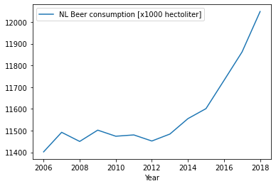

```python
# MCC Van Dyke et al., 2019
# JT Harvey, Applied Ergonomics, 2002
# DW Ziegler et al., 2005

```


```python
import pandas as pd
import matplotlib as plt

df = pd.read_csv('https://raw.githubusercontent.com/robbert-van-koesveld/CS_Assignment/master/istherecorrelation.csv', sep =";")


df.plot(x='Year',y='NL Beer consumption [x1000 hectoliter]')


```


    <matplotlib.axes._subplots.AxesSubplot at 0x2366fc38b50>





```python

```


```python

```
